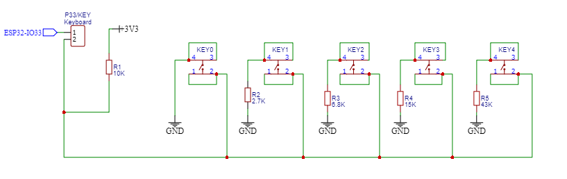

# AnalogKeryboard Library
This library is intended to convert analog signals coming from the ESP32-LAB PCB keyboard into independent keys, but it can also be used in other analog keyboard circuits with the appropriate parameter settings in the object constructor.

## AnalogKeyboard object constructor
The AnalogKeyboard library is already pre-adjusted for the ESP32-LAB board keyboard, but with a simple adjustment at the moment of instance of the AnalogKeyboard object, this library can serve another model of analog keyboards.

### The parameters are:
- pinKeyboard: Pin for analog reading of the keyboard circuit (Required);
- addressKey0: Analog address of key 0;
- addressKey1: Analog address of key 1;
- addressKey2: Analog address of key 2;
- addressKey3: Analog address of key 3;
- addressKey4: Analog address of key 4;
- ReadingAccuracy: Value in percentage to adjust the recognition accuracy of the analog reading of each key.

### Example:
```C++
AnalogKeyboard keyboard(33, 0, 870, 1657, 2457, 3322, 20);
```
In this example the keyboard was configured as follows:
- pinKeyboard: The analog reading GPIO pin is 33;
- addressKey0: The analog value of key 0 is 0;
- addressKey1: The analog value of key 1 is 870;
- addressKey2: The analog value of key 2 is 1657;
- addressKey3: The analog value of key 3 is 2457;
- addressKey4: The analog value of key 4 is 3322;
- ReadingAccuracy: The tolerance value for analog reading is 20%;

## AnalogKeyboard class methods
- hold: If the key remains pressed, the method returns true;
```C++
if(keyboard.hold(0)){
  Serial.println("Key 0 - HOLD");
}
```

- press: If the key is pressed, the method returns true;
```C++
if(keyboard.press(0)){
  Serial.println("Key 0 - PRESS");
}
```

- release: If the key is released after being pressed, the method returns true;
```C++
if(keyboard.release(0)){
  Serial.println("Key 0 - RELEASE");
}
```

## Examples of practical applications
### Press and release key
```C++
#include <Arduino.h>
#include <AnalogKeyboard.h>

AnalogKeyboard keyboard(33);

// ********************************************************************************************************
// <<<<<<<<<<<<<<<<<<<<<<<<<<<<<<<<<<<<<<<<< SETUP >>>>>>>>>>>>>>>>>>>>>>>>>>>>>>>>>>>>>>>>>>>>>>>>>>>>>>>>>
// ********************************************************************************************************
void setup() {
  Serial.begin(115200);
}
// ********************************************************************************************************
// <<<<<<<<<<<<<<<<<<<<<<<<<<<<<<<<<<<<<<<<< LOOP >>>>>>>>>>>>>>>>>>>>>>>>>>>>>>>>>>>>>>>>>>>>>>>>>>>>>>>>>
// ********************************************************************************************************
void loop() {
  // ----------- Press key -----------
  if(keyboard.press(0)){
    Serial.println("Key 0 - PRESS");
  }
  if(keyboard.press(1)){
    Serial.println("Key 1 - PRESS");
  }
  if(keyboard.press(2)){
    Serial.println("Key 2 - PRESS");
  }
  if(keyboard.press(3)){
    Serial.println("Key 3 - PRESS");
  }
  if(keyboard.press(4)){
    Serial.println("Key 4 - PRESS");
  }

  // ----------- Release Key ----------
  if(keyboard.release(0)){
    Serial.println("Key 0 - RELASE");
  }
  if(keyboard.release(1)){
    Serial.println("Key 1 - RELASE");
  }
  if(keyboard.release(2)){
    Serial.println("Key 2 - RELASE");
  }
  if(keyboard.release(3)){
    Serial.println("Key 3 - RELASE");
  }
  if(keyboard.release(4)){
    Serial.println("Key 4 - RELASE");
  }
}
```

### Electronic schematic
